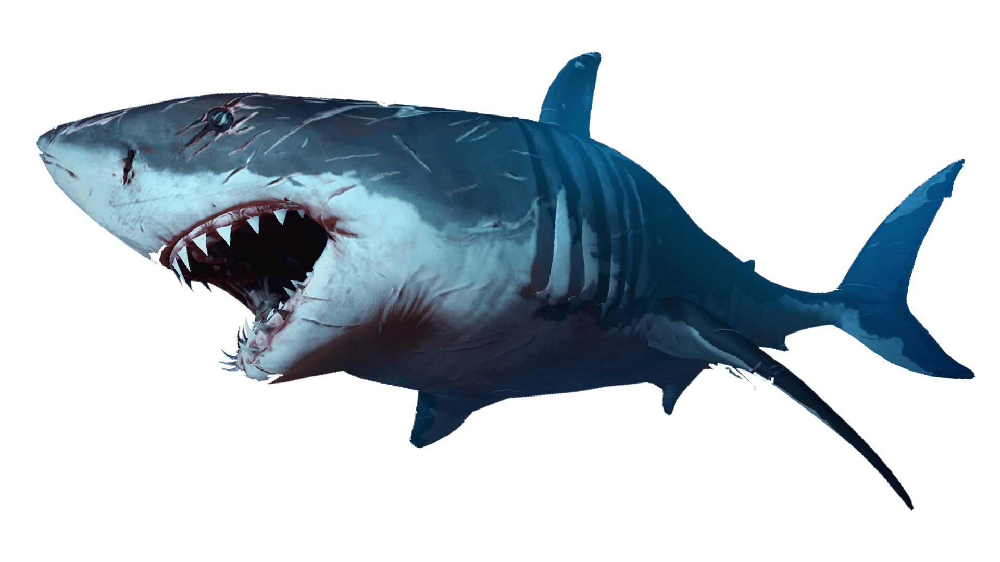

# Fish Finder
## What is it?

**Fish Finder** is a project for learning more about underwater life with some amazing *3D models*.

## What is the source of information in this project?

As I don't have enough info to share it [^1], I can't do it myself.

> **Chat GPT**: so need help?
> 
> **DevAbdelkader**: Yes!!!

So I asked him some questions about related topics and asked him to order them and perform some operations to get some amazing information!

## Project Contents

* **Developer Contents**
 
- - - [ ] 3D models for fishes and some coral reefs *( working on it )*
- - - [x] circular slider *( for dishes section, touching screens are supported! )*

* **User Contents**

- - - [x] Information about the length of the fish, swimming locations, 3D models of the fish, its danger to humans, and more 
- - - [x] Famous seafood dishes

[^1]: I gained my information only from National Geographic :joy:
